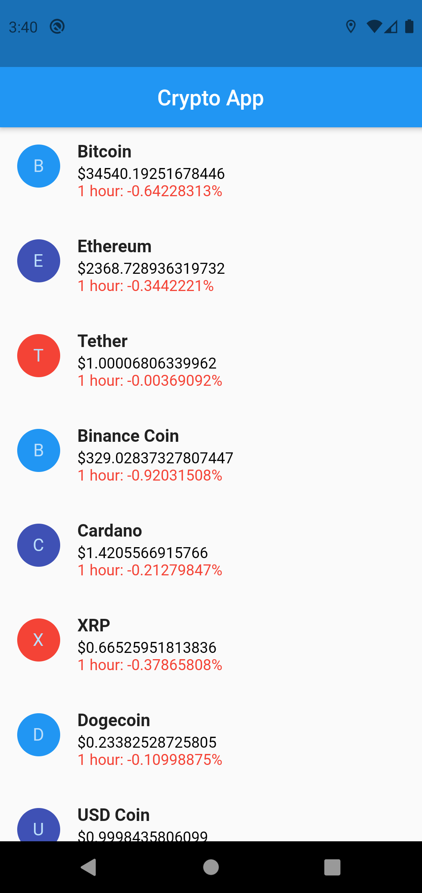

# crypto_example

A CryptoApp Flutter project.

## Getting Started

In main.dart file you have to add your API key in place of 'Your-API' to get your result.
You can get API from https://coinmarketcap.com/api/.

